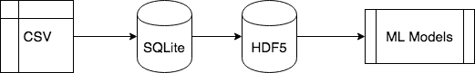
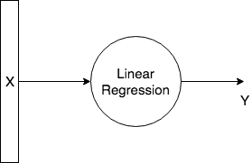
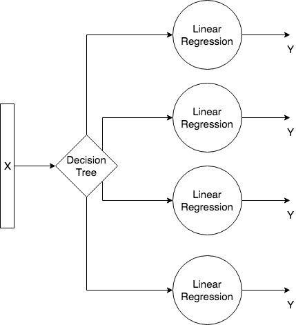
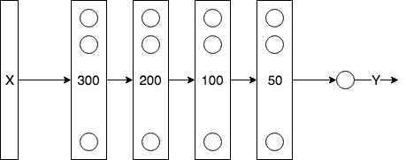
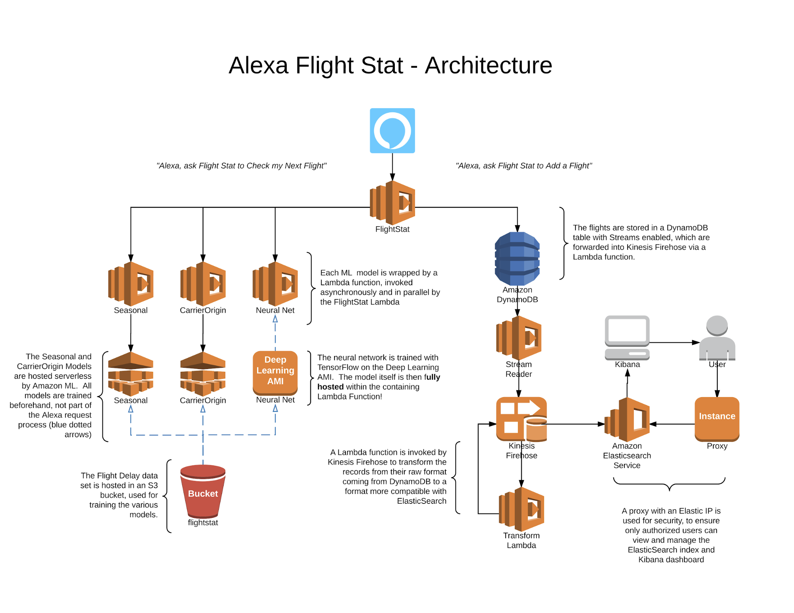

<html><head><meta content="text/html; charset=UTF-8" http-equiv="content-type"></head><body class="c15">

Sia Gholami Data Science Projects

<h1 class="c14" id="h.xxjvjoy5nv7u">Flight Stat</h1><h2 class="c6" id="h.pbcbp3yt9t0r">Use Case</h2>
Flight Stat is an Alexa app that speaks with the user, gathers flight information and predicts flight delays. I presented this project at re:Invent 2017.

Input (X): [Origin City, Destination City, Flight Date, Airline]

Output (Y): Flight Delay prediction in seconds 
<h2 class="c6" id="h.gkflz0bn0tce">Dataset </h2>
The dataset came from <a class="c8" href="https://www.google.com/url?q=https://www.transtats.bts.gov/DL_SelectFields.asp?Table_ID%3D236%26DB_Short_Name%3DOn-Time&amp;sa=D&amp;ust=1552249075336000">Bureau of Transportation Statistics</a>. It contains all domestic flight which is about 6,000,000 datapoints per year in CSV format. 
<h2 class="c6" id="h.ihz423qzzszc">Data Pipeline </h2>
To better visualize the data and be able to query the dataset, an ETL job imported the data into an SQLite database. Then, the data processed and normalized into the HDF5 format to be used for ML models. 

Fig 1. Flight Stat Data Pipeline

All ETL jobs are implemented in Python. 

<h2 class="c6 c16" id="h.a4ey5qa2x7wx"></h2><h2 class="c6" id="h.3vvktu72l15o">ML Models</h2>
I created and evaluated three ML models for this project: 
<h3 class="c3" id="h.31j7xz41emnh">Regression Model </h3>
The first model is a simple linear regression model with all the inputs. I was able to quickly implement this model and train it. I used this as a baseline for other models in this project. 

Fig 2. Flight Stat Regression Model

The model is implemented by AWS Lambda and Amazon Machine Learning.

<h3 class="c3 c5" id="h.mpwbqwmg7bgb"></h3><h3 class="c3" id="h.ovd5r8919nnd">Decision Tree + Regression Model </h3>
The second model is a simple decision tree plus four different linear regression models. The decision tree will determine the season of the prediction (e.g. Spring) and then uses the corresponding linear model for prediction. Four different models were trained independently based on their appropriate seasonal datapoints. 

Fig 3. Flight Stat Decision Tree + Regression Model 

The model is implemented by AWS Lambda and Amazon Machine Learning.

<h3 class="c3 c5" id="h.xbw4b0t0ufgx"></h3><h3 class="c3" id="h.tpepc4k1nkuu">Multilayer Perceptron Model (MLP)</h3>
The last model was a 5-layer MLP Neural Network that was trained on all the data. 

Fig 4. Flight Stat MLP Model

The model is implemented in TensorFlow.
<h2 class="c6" id="h.du54lhw59iv3">Training</h2>
The dataset was sliced into 99% training and 1% testing. I trained the MLP model on one P3.16xlarge with Deep Learning AMI. The model is saved after each epoch. 
<h2 class="c6" id="h.tq6o0yt8uv9">Inference</h2>
The inference is done with a saved TensorFlow model in a single lambda function. 
<h2 class="c6" id="h.cyc1ovk184zp">Deployment</h2>
The final models were all deployed in a serverless architecture using AWS Lambda:

 

Fig 5. Flight Stat Deployment Architecture

&nbsp; &nbsp; &nbsp; &nbsp; &nbsp; &nbsp; &nbsp; &nbsp; &nbsp; &nbsp; &nbsp; &nbsp; &nbsp; &nbsp; &nbsp; &nbsp; &nbsp; &nbsp; &nbsp; &nbsp; &nbsp; &nbsp; &nbsp; &nbsp; &nbsp; &nbsp; &nbsp; &nbsp; &nbsp; &nbsp; &nbsp; &nbsp; &nbsp; &nbsp; &nbsp; &nbsp; &nbsp; &nbsp; &nbsp; &nbsp; &nbsp; &nbsp; &nbsp; &nbsp; &nbsp; &nbsp; &nbsp; &nbsp; &nbsp; &nbsp; &nbsp; &nbsp; &nbsp; &nbsp; &nbsp; &nbsp; &nbsp; &nbsp; &nbsp; &nbsp; &nbsp; &nbsp; &nbsp; &nbsp; &nbsp; &nbsp;

</body></html>
